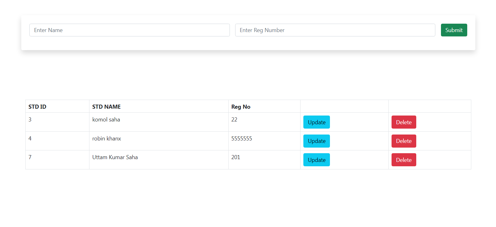

# PHP CRUD 
This is a simple php crud operation. CRUD is an acronym for Create, Read, Update, and Delete. CRUD operations are basic data manipulation for database. This  simple PHP CRUD application to perform all these operations on a MySQL database table at one place. Database included in the files section.
## Features
* Read Data
* Insert data
* Delete data
* Update Data
## output

